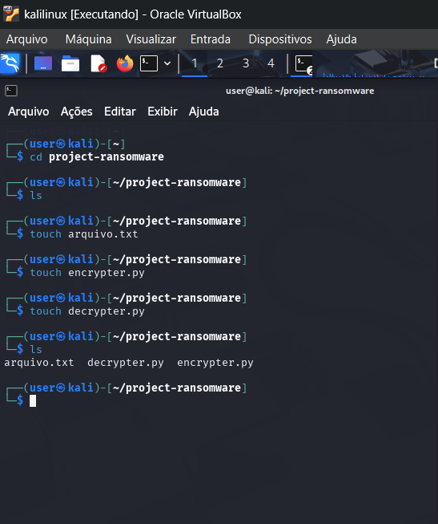
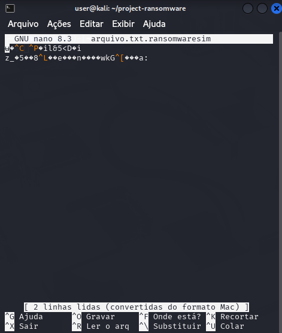
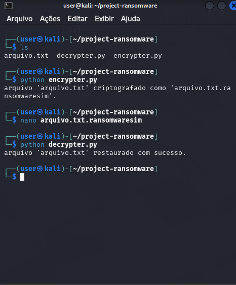

# Criando um Ransomware Utilizando Scripts em Python

### Ferramentas utilizadas:
- Virtualbox
- Kali Linux

### Desenvolvimento do ambiente
- Criar um diretorio para o projeto: --- mkdir project-ransomware ---
- criar um arquivo de teste que será nosso alvo do ataque de ransomware: --- touch arquivo.txt ---
- criar os scripts em python: --- touch encrypter.py --- | --- touch decrypter.py ---
- escrever um "conteudo" para o arquivo.txt: --- nano arquivo.txt --
- executar o script de criptografia: --- python encrypter.py ---
- checar o arquivo criptografado: --- nano arquivo.txt.ransomwaresim ---
- executar o script de descriptografia: --- python decrypter.py ---
- checar o arquivo descriptografado: --- nano arquivo.txt ---

### Criando os scripts de criptografia e descriptografia
- escrever o codigo do script que fará a criptografia: --- nano encrypter.py ---
- escrever o codigo do script que fará a descriptografia: --- nano decrypter.py ---
- utilizar a mesma chave de 16 bytes nos dois

### Resultados esperados

